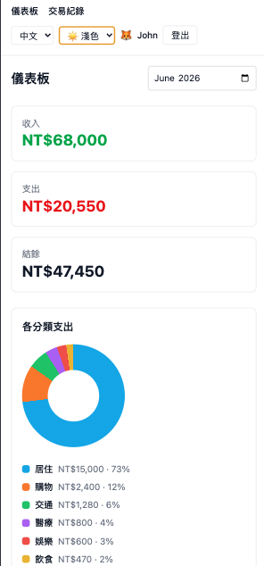
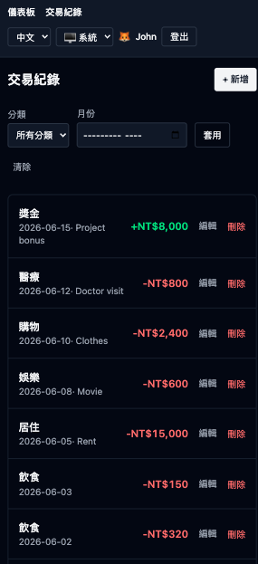
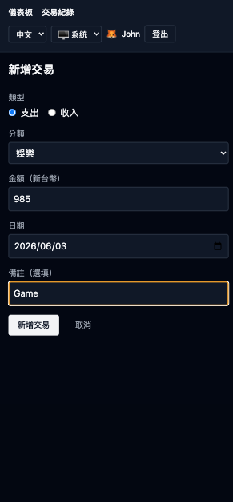

# SvelteKit 線上帳簿 | 具備 AI 輔助工程流程的全端 Starter Kit

[](https://codecov.io/gh/john-data-chen/sveltekit-starter-kit)
[](https://sonarcloud.io/summary/new_code?id=john-data-chen_sveltekit-starter-kit)
[](https://github.com/john-data-chen/sveltekit-starter-kit/actions/workflows/ci.yml)
[](https://opensource.org/licenses/MIT)

這是一個產品級別的 SvelteKit starter kit，以真實可用的多使用者 **線上帳簿** 為核心，展示技術決策、品質工程，以及 AI 輔助開發的實作方式。技術棧包含 Svelte 5（runes mode）、TypeScript、Tailwind CSS v4、Drizzle ORM 與 PostgreSQL。

英文版本請見 **[README.md](./README.md)**。

**[Live Demo](https://sveltekit-starter-kit.vercel.app/login)** — 按下 **以 Email 繼續** 即可用已建立的使用者登入。

<table>
  <tr>
    <td align="center"></td>
    <td align="center"></td>
    <td align="center"></td>
    <td align="center"></td>
  </tr>
  <tr>
    <td align="center"><b>Login</b></td>
    <td align="center"><b>Dashboard</b></td>
    <td align="center"><b>Transactions</b></td>
    <td align="center"><b>Add Record</b></td>
  </tr>
</table>

---

| 指標           | 結果                                                                               |
| -------------- | ---------------------------------------------------------------------------------- |
| Test Coverage  | 見上方 **codecov** badge，由 Vitest（unit + integration）量測                      |
| Code Quality   | 見上方 **SonarCloud Quality Gate** badge（Security、Reliability、Maintainability） |
| E2E Validation | Playwright 跨瀏覽器驗證（Chrome / Edge / Safari）                                  |
| CI/CD Pipeline | GitHub Actions → SonarCloud + Codecov → Vercel                                     |

---

## 技術決策

### 架構

| 類型      | 選擇                                          | 理由                                                  |
| --------- | --------------------------------------------- | ----------------------------------------------------- |
| Framework | SvelteKit 2 + Svelte 5（runes）               | 精細的響應性、極簡樣板、SSR + 表單操作                |
| Styling   | Tailwind CSS v4（Vite plugin）                | 公用優先、零執行時間，透過 v4 Vite plugin 加速建置    |
| Database  | Drizzle ORM + PostgreSQL                      | 類型安全 SQL、明確查詢、比大型 ORM 更輕量             |
| DB Driver | `postgres`（TCP）                             | 快速 pooled driver，適合 Vercel Node serverless 服務  |
| Auth      | Passwordless email + signed `httpOnly` cookie | 不儲存密碼；使用最小且清楚的 session model            |
| Charts    | Pure CSS donut                                | 不引入圖表套件，減少打包體積並保留完整控制            |
| i18n      | Paraglide JS（`@inlang/paraglide-js`）        | 類型安全、tree-shakeable messages；支援英文與繁體中文 |
| Deploy    | `@sveltejs/adapter-vercel`（Node serverless） | `postgres` TCP driver 需要 Node runtime               |

### 品質保證

| 類型              | 工具       | 理由                                       |
| ----------------- | ---------- | ------------------------------------------ |
| Unit/Integration  | Vitest     | 比 Jest 更快，原生 ESM，與 Vite 生態整合佳 |
| E2E               | Playwright | 跨瀏覽器支援，比 Cypress 更輕量            |
| Static Analysis   | SonarCloud | 在 CI 中執行 quality gates                 |
| Coverage Tracking | Codecov    | 自動整合 PR coverage                       |

**Testing Strategy:**

- Unit tests 聚焦查詢邏輯、驗證、貨幣 格式化 / 解析
- E2E tests 驗證重要流程（登入、transaction CRUD）
- 每次 push / PR 都會先跑完整 pipeline，通過後再 merge (免費 server 效能不足，因此 CI 只執行 unit test)

### Developer Experience

| 工具                        | 用途                                              |
| --------------------------- | ------------------------------------------------- |
| oxlint                      | Rust-based JS/TS linter，比 ESLint 快 50-100 倍   |
| oxfmt                       | Rust-based formatter，處理 JS/TS/CSS/HTML/JSON/MD |
| ESLint + Prettier（Svelte） | 專門處理 `.svelte` 檔案的 lint/format             |
| Vite                        | 近乎即時的 HMR 與快速建置                         |
| Husky + lint-staged         | pre-commit 品質檢查                               |
| commitlint + Commitizen     | Conventional commits，維持乾淨 commit history     |

---

## 功能

- **Passwordless email login** — 內建三個帳號（`john@example.com`、`sophia@example.com`、`mark@example.com`）；表單預填 `john@example.com`，按一次即可登入。`userId` 會存放在 signed `httpOnly` session cookie。
- **Transactions CRUD** — 可新增、查看、編輯、刪除收入/支出紀錄（數目、類型、類別、日期、備註）。
- **List & filter** — 可依 類型 與 月份 篩選交易紀錄；查詢條件會保存在 URL。
- **Dashboard** — 顯示當月收入、支出、結餘，以及以 原生CSS 製作的類型圓環圖。
- **Per-user data isolation** — 每個查詢都會以登入使用者做限制；使用者只能看到自己的資料。
- **Currency** — 僅支援 TWD，金額以整數儲存，不使用小數。
- **i18n** — 英文與繁體中文（Paraglide JS）。
- **Theme switching** — 淺色 / 深色 / 系統。
- **Responsive design** — 手機小螢幕排版優先，也支援電腦大螢幕排版。

Category 固定定義於 `src/lib/categories.ts`；session cookie 使用 `.env` 中的 `SESSION_SECRET` 簽章。

---

## AI-Augmented Engineering Workflow

這個專案採用 Human-in-the-Loop 的 AI 協作方式。AI 工具不只是產生程式碼，而是被用來提高 **架構槓桿、品質保證與開發速度**。

### AI Agent Skills（`.agents/skills/`）

Skills 會提交到 repo，並透過 `AGENTS.md` / `CLAUDE.md` 提供給 AI assistants。每個 skill 都封裝了特定工作流與專案慣例。

| Skill                                                                                    | 職責                                                                                        |
| ---------------------------------------------------------------------------------------- | ------------------------------------------------------------------------------------------- |
| [karpathy-guidelines](https://github.com/forrestchang/andrej-karpathy-skills)            | 降低 LLM 程式碼錯誤：明確假設、優先簡單方案、手術刀式修改、目標導向循環                     |
| [doc-coauthoring](https://github.com/anthropics/skills/tree/main/skills/doc-coauthoring) | 文件共筆的 3 階段工作流程（上下文 → 精煉 → 讀者測試），本 README 由此技能與作者共同協作產生 |
| **session-handoff (my private skill)**                                                   | 維護 `ai-docs/tasks.md` + `ai-docs/session-log.md`，讓跨模型/跨 session 接手時沒有資訊斷層  |
| [drizzle](https://skillsmp.com/skills/lobehub-lobehub-agents-skills-drizzle-skill-md)    | Drizzle ORM 最佳實踐                                                                        |
| [svelte-code-writer](https://svelte.dev/docs/ai/skills)                                  | 用於在建立/編輯任何 `.svelte` 檔案時尋找技術文件和進行程式碼分析的 CLI 工具                 |
| [svelte-code-writer](https://svelte.dev/docs/ai/skills)                                  | 編寫快速、健壯、現代的 Svelte 程式碼的指南。                                                |

### MCP（Model Context Protocol）Servers

MCP 讓 AI 工具可直接和開發基礎設施互動，減少人工切換脈絡。

| Server                                                                       | Integration Point | Workflow Enhancement                                                              |
| ---------------------------------------------------------------------------- | ----------------- | --------------------------------------------------------------------------------- |
| [svelte-mcp](https://svelte.dev/docs/ai/mcp)                                 | Svelte docs       | 官方 Svelte 5 / SvelteKit docs、examples、code autofixing（已提交於 `.mcp.json`） |
| [context7](https://github.com/upstash/context7)                              | Documentation     | 提供 AI agents version-accurate 的即時 library docs                               |
| [chrome-devtools-mcp](https://github.com/ChromeDevTools/chrome-devtools-mcp) | Browser state     | 讓 AI agents 透過 DevTools Protocol 檢查與驗證正在執行的 app                      |

### AI Guidelines（`AGENTS.md` / `CLAUDE.md`）

這些檔案是 AI assistants 的專案工作守則，包含主要驗證流程（`pnpm lint` → `pnpm build` → `pnpm check`）、常用指令，以及不同任務應使用的 skills/MCP servers。AI tools 在修改此 repo 前應先讀取這些指引。

### 可衡量的影響

透過將 AI 整合到技術堆疊中，本專案實現了以下目標：

- **速度**：樣板程式碼和標準模式的實現速度提升 5-10 倍，借助 Gemini Code Assist 將 PR 審查時間縮短 30-40%。
- **品質**：透過 AI 產生的測試框架，以及 Gemini Code Assist 的 PR 審查，實現更高的測試覆蓋率（80% 以上），從而減少 bug 和程式碼異味。
- **學習**：透過 AI 指導的實現，快速掌握新工具（Svelte、Sveltekit、Drizzle 等）。
- **成本**：利用 AI 代理的技能減少程式碼迭代次數並遵循最佳實踐，從而降低成本。
- **專注**：將工程時間從語法開發轉移到系統架構和使用者體驗。

---

## Quick Start

### Requirements

- Node.js >= 24
- pnpm 11.5+
- Docker / OrbStack（本機 PostgreSQL）

### Setup

```bash
pnpm install

# Environment — set DATABASE_URL + SESSION_SECRET
cp .env.example .env

# Database
pnpm db:start          # Start PostgreSQL via Docker (compose.yaml)
pnpm db:migrate        # Apply migrations to the local DB
pnpm db:seed           # Seed 3 demo users + sample transactions

# Run
pnpm dev               # Development server
pnpm test              # Unit tests
pnpm test:e2e          # E2E tests (needs a seeded DB + dev server)
pnpm build             # Production build
```

`.env.example` 的預設 `DATABASE_URL` 與 `compose.yaml` 相符。請將 `SESSION_SECRET` 設成一段足夠長的隨機字串，用來簽署 session cookie。接著開啟 dev server（預設 `http://localhost:5173`），按下 **以 Email 繼續** 即可用 `john@example.com` 登入。

### Commands

```bash
pnpm dev           # Start dev server
pnpm build         # TypeScript compile + Vite build
pnpm preview       # Preview production build
pnpm lint          # oxlint --fix (JS/TS) + eslint (Svelte)
pnpm format        # oxfmt --write . (JS/TS/etc) + prettier --write Svelte
pnpm test          # vitest run
pnpm test:coverage # vitest run --coverage
pnpm test:e2e      # Playwright e2e
pnpm check         # svelte-kit sync + svelte-check
pnpm commit        # git-cz (commitizen with commitlint)
pnpm db:start      # docker compose up (PostgreSQL)
pnpm db:generate   # drizzle-kit generate
pnpm db:migrate    # drizzle-kit migrate
pnpm db:push       # drizzle-kit push
pnpm db:seed       # Seed demo users + sample transactions
pnpm db:studio     # drizzle-kit studio
```

---

## Project Structure

```text
.
├── .agents/skills/              # Repo 專用 AI skills，由 AGENTS.md / CLAUDE.md 使用
│   ├── doc-coauthoring/         # 文件共筆 workflow
│   ├── drizzle/                 # Drizzle schema/query 慣例
│   ├── karpathy-guidelines/     # Surgical change 與驗證紀律
│   ├── session-handoff/         # 維護 ai-docs/tasks.md + session-log.md
│   ├── svelte-code-writer/      # Svelte MCP/CLI 查詢與 autofix workflow
│   └── svelte-core-bestpractices/
├── .github/workflows/ci.yml     # GitHub Actions：install、test、Codecov、SonarCloud
├── .husky/                      # Git hooks（pre-commit, commit-msg）
├── .opencode/                   # OpenCode AI configuration
├── .vscode/                     # VS Code settings + extension recommendations
├── ai-docs/                     # AI task template、task plan、session log
├── drizzle/                     # Generated SQL migrations + Drizzle metadata snapshots
├── e2e/
│   └── expense.spec.ts          # Playwright login + transaction CRUD happy path
├── messages/                    # Paraglide source messages
│   ├── en.json                  # 英文翻譯檔
│   └── zh-tw.json               # 繁體中文翻譯檔
├── src/
│   ├── app.d.ts                 # SvelteKit app types（App.Locals.user）
│   ├── app.html                 # HTML shell，包含 Paraglide lang/dir placeholders
│   ├── hooks.server.ts          # Session lookup、locale middleware、theme class injection
│   ├── lib/
│   │   ├── assets/              # Favicon 與 README screenshots
│   │   ├── components/          # CategoryChart, LocaleSwitcher, ThemeToggle, TransactionForm
│   │   ├── server/
│   │   │   ├── db/
│   │   │   │   ├── index.ts     # 使用 DATABASE_URL 的 Drizzle client
│   │   │   │   ├── queries.ts   # User-scoped CRUD + dashboard aggregates
│   │   │   │   ├── schema.ts    # users / transactions tables 與 transaction_type enum
│   │   │   │   ├── schema.spec.ts
│   │   │   │   └── seed.ts      # Demo users 與 transactions
│   │   │   ├── auth.ts          # HMAC-signed httpOnly session cookie
│   │   │   ├── guards.ts        # requireUser protected-route helper
│   │   │   ├── login.ts         # Passwordless email lookup
│   │   │   ├── session.ts       # Cookie -> database-backed SessionUser resolver
│   │   │   └── validation.ts    # Transaction form validation
│   │   ├── categories.ts        # 固定 category keys + localized labels
│   │   ├── constants.ts         # App name、demo email、pageTitle helper
│   │   ├── date.ts              # YYYY-MM / YYYY-MM-DD helpers
│   │   ├── money.ts             # TWD integer formatting/parsing
│   │   ├── theme.svelte.ts      # Client theme store（light / dark / system）
│   │   ├── theme.ts             # Server-safe theme constants and helpers
│   │   └── transaction.ts       # Transaction form value types
│   ├── routes/
│   │   ├── login/               # Passwordless email sign-in page/action + route spec
│   │   ├── logout/              # Sign-out action
│   │   ├── transactions/
│   │   │   ├── [id]/edit/       # Edit form load/action，含 ownership check
│   │   │   ├── new/             # Create form load/action
│   │   │   └── +page.*          # List/filter page + delete action
│   │   ├── +layout.server.ts    # Auth guard 與所有頁面的 user data
│   │   ├── +layout.svelte       # App shell、nav、locale/theme controls、logout form
│   │   ├── +page.server.ts      # Dashboard monthly stats loader
│   │   ├── +page.svelte         # Dashboard UI 與 pure-CSS category chart
│   │   └── layout.css           # Tailwind v4 import 與 global styles
│   └── *.spec.ts                # 與 source modules colocated 的 unit/integration specs
├── static/
│   └── robots.txt               # Public static asset
├── .env.example                 # DATABASE_URL + SESSION_SECRET template
├── .mcp.json                    # Svelte MCP server registration
├── .npmrc                       # pnpm/node package manager settings
├── .oxfmtrc.json                # oxfmt formatter config
├── .oxlintrc.json               # oxlint JS/TS lint rules
├── .prettierignore              # Prettier ignore rules
├── .prettierrc                  # Prettier + Svelte/Tailwind plugin config
├── AGENTS.md                    # 此 repo 的 AI agent instructions
├── README.md                    # English README
├── README-cht.md                # 繁體中文 README
├── commitlint.config.mjs        # Conventional commit config
├── compose.yaml                 # Local PostgreSQL service
├── drizzle.config.ts            # Drizzle Kit config
├── eslint.config.js             # Svelte files 的 ESLint config
├── package.json                 # Scripts、dependencies、lint-staged、engines
├── playwright.config.ts         # Cross-browser e2e configuration
├── pnpm-lock.yaml               # Locked dependency graph
├── pnpm-workspace.yaml          # pnpm workspace 與 minimum-release-age policy
├── skills-lock.json             # Locked AI skill/plugin metadata
├── sonar-project.properties     # SonarCloud project configuration
├── svelte.config.js             # SvelteKit config、Vercel adapter、forced runes mode
├── tsconfig.json                # TypeScript config，extends generated SvelteKit config
└── vite.config.ts               # Vite plugins：Tailwind、SvelteKit、Paraglide；Vitest config
```

---

## 新世代工具採用

這個專案會持續評估新興工具，並根據可量測的效益決定是否採用。

### Oxlint（Rust-based Linter）

| 面向        | 說明                                      |
| ----------- | ----------------------------------------- |
| Status      | **Production** — 已啟用 JS/TS linting     |
| Performance | 比 ESLint 快 50-100 倍                    |
| Scope       | ESLint + Prettier 僅保留給 `.svelte` 檔案 |

[Oxlint](https://oxc.rs/docs/guide/usage/linter.html)

### Oxfmt（Rust-based Formatter）

| 面向        | 說明                                           |
| ----------- | ---------------------------------------------- |
| Status      | **Production** — 格式化 JS/TS/CSS/HTML/JSON/MD |
| Performance | 約比 Prettier 快 30 倍，冷啟動幾乎即時         |
| Scope       | ESLint + Prettier 僅保留給 `.svelte` 檔案      |

[Oxfmt](https://oxc.rs/docs/guide/usage/formatter)

---

## Live Demo Constraints

| 面向         | 目前狀態                                                             | Production 建議               |
| ------------ | -------------------------------------------------------------------- | ----------------------------- |
| **Hosting**  | Vercel free tier                                                     | Paid tier / 多區域 deployment |
| **Database** | Free-tier Neon                                                       | 根據地區優化的 DB             |
| **Data**     | 預先建立的 Demo 資料；示範帳號由訪客共用，但每個帳號的資料仍彼此隔離 | 真實帳號隔離                  |

Demo 使用免費等級以降低成本。Production 應根據真實使用者地區補上適當的地區性優化。
